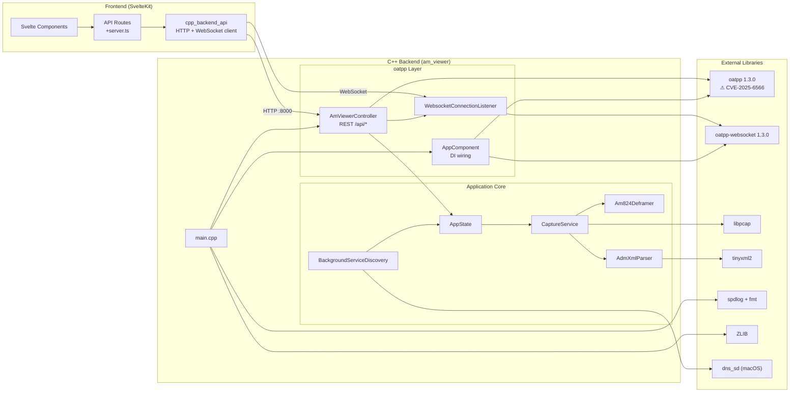

# Architecture

```mermaid
graph LR
    subgraph Frontend["Frontend (SvelteKit)"]
        direction TB
        Components["Svelte Components"]
        Routes["API Routes\n+server.ts"]
        BackendAPI["cpp_backend_api\nHTTP + WebSocket client"]
        Components --> Routes --> BackendAPI
    end

    subgraph Backend["C++ Backend (am_viewer)"]
        direction TB
        Main["main.cpp"]

        subgraph OatppLayer["oatpp Layer"]
            direction TB
            AppComp["AppComponent\nDI wiring"]
            Controller["AmViewerController\nREST /api/*"]
            WSListener["WebsocketConnectionListener"]
        end

        subgraph AppCore["Application Core"]
            direction TB
            AppState["AppState"]
            CaptureSvc["CaptureService"]
            Deframer["Am824Deframer"]
            AdmParser["AdmXmlParser"]
            SvcDiscovery["BackgroundServiceDiscovery"]
        end

        Main --> AppComp
        Main --> Controller
        Controller --> AppState
        Controller --> WSListener
        AppState --> CaptureSvc
        CaptureSvc --> Deframer
        CaptureSvc --> AdmParser
        SvcDiscovery --> AppState
    end

    subgraph ExtLibs["External Libraries"]
        direction TB
        oatpp["oatpp 1.3.0\n⚠ CVE-2025-6566"]
        oatppWS["oatpp-websocket 1.3.0"]
        libpcap["libpcap"]
        tinyxml2["tinyxml2"]
        spdlog["spdlog + fmt"]
        zlib["ZLIB"]
        dnssd["dns_sd (macOS)"]
    end

    BackendAPI -- "HTTP :8000" --> Controller
    BackendAPI -- "WebSocket" --> WSListener

    AppComp --> oatpp
    AppComp --> oatppWS
    Controller --> oatpp
    WSListener --> oatppWS
    CaptureSvc --> libpcap
    AdmParser --> tinyxml2
    Main --> spdlog
    Main --> zlib
    SvcDiscovery --> dnssd
```
